<!--
  Profile README for github.com/az-said/az-said
  The picture element auto-swaps dark/light based on the viewer's GitHub theme.

  To switch the portrait look later, either:
    A) edit config.py  ->  "portrait_mode": "truecolor" | "neon" | "duotone"
       and "portrait_style": "pixel" | "ascii" | "braille", then run:  python3 generate.py
    B) or point the srcset below at a ready-made alternate in ./out:
       alt_truecolor_{dark,light}.svg, alt_neon_{dark,light}.svg, alt_ascii_{dark,light}.svg
-->

<picture>
  <source media="(prefers-color-scheme: dark)"  srcset="./out/dark_mode.svg">
  <source media="(prefers-color-scheme: light)" srcset="./out/light_mode.svg">
  
</picture>

 

&nbsp;

